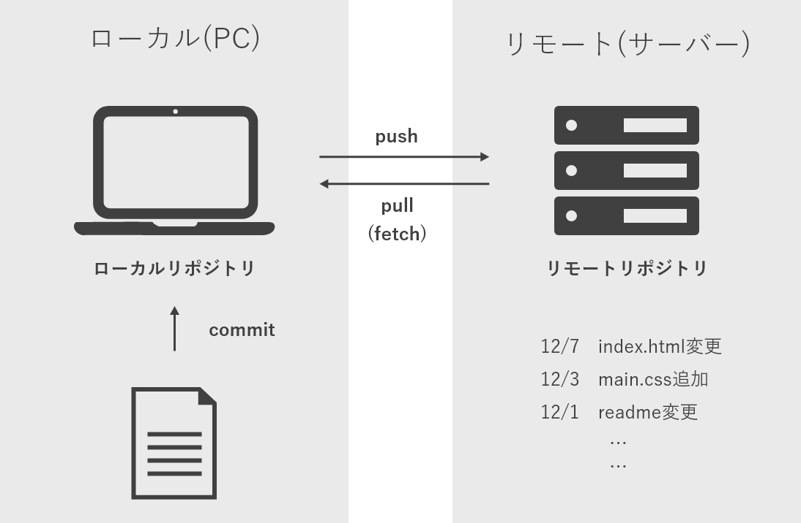
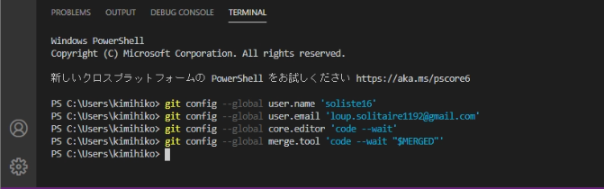
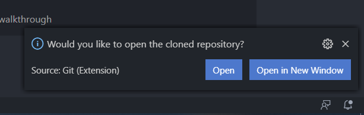
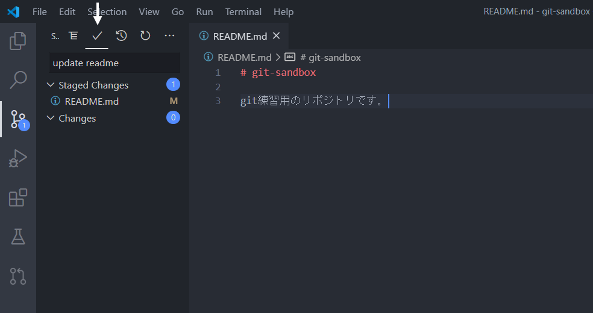

# Gitの使い方

- [0 Gitってなんだろう？](#0)
- [1 Gitの仕様](#1)
    - [1-1 リポジトリ（repository）](#1-1)
    - [1-2 コミット（commit）](#1-2)
    - [1-3 プッシュ（push）](#1-3)
    - [1-4 ブランチとマージ（branch & merge）](#1-4)
    - [1-5 フェッチとプル（fetch & pull）](#1-5)
    - [1-6 クローン（clone）](#1-6)
    - [1-7 まとめ](#1-7)
- [2 Gitのインストール](#2)
- [3 Git実践](#3)
    - [3-1 リポジトリ作成](#3-1)
    - [3-2 リポジトリをクローン](#3-2)
    - [3-3 コミットとプッシュ](#3-3)
    - [3-4 フェッチとプル](#3-4)
    - [3-5 ブランチとプルリクエスト](#3-5)

## 0　Gitってなんだろう？　<a id="0"></a>

Gitとは、端的に言えばファイルのバージョン管理が簡単にできるツールです。バージョン管理は、ファイルの変更内容や変更履歴を保持しておいて、後から古い状態に戻したりできるようにするためのものです。Gitは古いバージョンに簡単に戻せるほか、複数人で修正した部分を1つに統合することもできるため、開発を効率化することができます。

## 1　Gitの仕様　<a id="1"></a>



### 1-1　リポジトリ（repository）　<a id="1-1"></a>

リポジトリとはファイルやディレクトリの状態を記録する場所で、ファイルやディレクトリをリポジトリの管理下に置くことで、そのディレクトリ内のファイルやディレクトリの変更履歴を記録することができます。リポジトリはリモートリポジトリとローカルリポジトリの2種類があります。

#### リモートリポジトリ

専用のサーバーに配置して複数人で共有するためのリポジトリです。リモートリポジトリからアップロードされた他の人のファイルを閲覧できます。

#### ローカルリポジトリ

個人のユーザーが利用するために、自分の手元のマシン上に管理するリポジトリのことです。ローカルリポジトリで編集した内容をリモートリポジトリにアップロードしたり、はたまたリモートリポジトリの変更内容をローカルリポジトリにダウンロードすることができます。

これら2種類のリポジトリに分けることで、普段の作業はそれぞれのユーザーが手元のローカルリポジトリで行い、作業内容を共有するときにリモートリポジトリで公開するという使い方になります。

### 1-2　コミット（commit）　<a id="1-2"></a>

コミットはファイルやディレクトリの編集作業をローカルリポジトリに記録する操作のことです。コミットを実行するとファイルの編集履歴と編集した日時を記録したファイルが生成されます。ただし、編集したファイルをいきなりコミットするわけではありません。ユーザーが編集している作業中のディレクトリのことをワークツリーといいます。ここでの変更内容をローカルリポジトリにコミットするには、一旦ステージング・エリアという中間領域に変更したファイルを登録する必要があります。通常、複数の変更ファイルをステージング・エリアに仮置き（add）しておいて、まとめてコミットするという形になります。

### 1-3　プッシュ（push）　<a id="1-3"></a>

プッシュは、ローカルリポジトリにコミットしたファイルを共有するためにリモートリポジトリに送信して保存する機能です。

### 1-4　ブランチとマージ（branch & merge）　<a id="1-4"></a>

ブランチはファイルの編集履歴を分岐させて記録していく機能のことです。分岐したブランチは他のブランチの影響を受けないため同じリポジトリ内でも複数の変更を同時に進めることができます。Gitでリポジトリを新規作成すると、デフォルトでmasterブランチ（今後はmainブランチに名称が変更される予定です）が作成されます。通常masterブランチに直接コミットするのではなく、開発用のブランチを作成し、ここに変更を加えます。masterブランチには進捗状況に応じて、適宜、開発用ブランチの変更を反映させることになります。このようにあるブランチの変更を別のブランチに反映させる操作のことをマージといいます。


### 1-5　フェッチとプル（fetch & pull）　<a id="1-5"></a>

フェッチはリモートリポジトリからファイルの最新情報を取得してくる操作のことです。共有されているファイル（リモートリポジトリ）の更新を確認したり、複数人の作業の擦り合わせのために使う機能といえます。ただし、**ローカルのファイルを更新することはありません。**

ここで、ローカルとリモートがどのように結びついているのかを説明する必要があります。ローカルリポジトリ（以下、ローカル）にもリモートリポジトリ（以下、リモート）にもmasterブランチは存在します（リモートの内容をローカルにコピーしているので当然です）。ですが、ローカルにはそれに加えてorigin/masterブランチが用意されています（masterブランチに限らず、作成したブランチごとに自動的に生成されます）。このブランチはリモートと結びついており、フェッチをするたびにリモートの内容をとってきて最新の状態に更新されます。つまり、フェッチ段階ではmasterブランチが変更されずにorigin/masterブランチが更新されるので、masterブランチにあるローカルのファイルが更新されることはないのです。

ではどのようにローカルのファイルを更新するかというと、origin/masterブランチをmasterブランチにマージすれば良いのです。この時点で初めてローカルのファイルがリモートにある状態に更新されます。そして、このフェッチとマージを同時に行うのがプルです。プルをすることで、共有されているリモートに保存されているファイルの内、ローカルに無いファイルや他のユーザーが更新したファイルのみをダウンロードして一気に更新することができます。

### 1-6　クローン（clone）　<a id="1-6"></a>

クローンはリモートリポジトリをまるごと自分のローカルリポジトリに保存する機能ですので、ほとんどの場合Gitで最初に行う作業になります。最初にリポジトリをクローンしてから差分を適宜プルするというのが一般的な使い方です。

### 1-7　まとめ　<a id="1-7"></a>

最後に以上のことをまとめておきましょう。

1. リモートリポジトリをローカルに**クローン**する
2. ファイルを変更したら、**ステージング・エリアに登録**した後**コミット**する
3. コミットを共有するためにリモートに**プッシュ**する
4. リモートに変更があれば**フェッチ**した後**マージ**する（**プル**）

## 2　Gitのインストール　<a id="2"></a>

Gitがインストールされていない場合は、ダウンロードサイト（ https://git-scm.com ）からGitをダウンロードしましょう。VSCodeの場合は、左サイドバー3つ目にあるソース管理ビューからダウンロードサイトに飛ぶことができます。


ダウンロードページに飛んだら、以下にある最新版をダウンロードしましょう。インストールはウィザードにしたがってNextをクリックし続ければ問題なくできると思います。


インストールが終わったら、最低限ユーザー名とメールアドレスをGitに設定しておきましょう。これにより、コミットしたときに誰が行なったコミットかを記録することができます。

VSCodeにはpowershellと呼ばれるターミナルが用意されていますので、コマンドプロンプト等を開く必要はありません。ショートカット`ctrl + @`でターミナルの画面が開くので、そこに以下を打ち込みましょう。当然ユーザー名とメールアドレスは自分のGitHubアカウントのものと一緒にしましょう。また、以下には先頭に`$`（ドルマーク）がついていますがこれは書く必要はありません。Linuxにおいてこのマークは一般ユーザーであることを表すもので、Linuxコマンドを表現する場合には先頭にこのマークが良くつけられるということだけ覚えておきましょう。

```bash
$ git config --global user.name 'ユーザー名'
$ git config --global user.email 'メールアドレス'
```

下の画像ではこれ以外にも使用エディタの登録を行っていますが行わなくても大丈夫です。



以上でGitのインストールは終了です。次からは実際にGitの操作を行っていきます。

## 3　Git実践　<a id="3"></a>

ここから先では、練習用に自分のリポジトリを作成し、それを使用してGitの使い方を学んで行きます。

### 3-1　リポジトリ作成　<a id="3-1"></a>

最初にリポジトリを作成しましょう。自分のGitHubアカウント画面に入ると、`Repositories`というタブがあります。そのページの右上に緑色の`New`ボタンがあるのでそれをクリックしましょう。


すると、以下のようなページに遷移します。ここで`Repository name`に好きな名前を入れてください。次にリポジトリを誰でも見られるように`Public`にするか、見られる人を限定できるように`Private`にするかを決める必要があります。大抵の場合は`Private`で作りましょう。これは後からでも変更可能です。最後に`Add a README file`にチェックを入れます。このファイルには通常リポジトリの説明を書くので、基本的に用意するようにしましょう。最後に`Create repository`を押して、リポジトリを作成します。


これで、EADMEファイルのみが入っている空のリポジトリを生成することができました。


### 3-2　リポジトリをクローン　<a id="3-2"></a>

次に、いま作成したリモートリポジトリをローカルにクローンします。リポジトリがすでにある場合はここからスタートします。

まず、クローンしたいリポジトリページの右上にある緑色の`Code`ボタンをクリックします。ここで、`HTTPS`と書かれた欄のURLをクリップボードにコピーします。


再度VSCodeを開いてショートカット`ctrl+shift+p`でコマンドパレットを開きます。コマンドパレットでは、VSCodeで実行できる機能の名前を打ち込んで実行することができます。ここで、`git clone`と打ち込みます。


出てきたリストの一番上をクリックしましょう。すると、クローンするリポジトリのURLを求められるので、先ほどコピーしたURLを張り付けてEnterを押します。


リポジトリの保存場所を選択する必要があるので、適当なところを選んでください。ここで`Select Repository Location`をクリックするとクローンが始まります。


クローンが終わると、右下にクローンしたリポジトリを開くか尋ねられるので`Open`をクリックして開いてみましょう。



左サイドバー1つ目のエクスプローラービューは、フォルダの中身を階層表示してくれる部分です。ここにリポジトリ名（以下では`GIT-SANDBOX`）と唯一のファイル`README.md`が表示されていればこれでクローンは完了です。


### 3-3　コミットとプッシュ　<a id="3-3"></a>

今度はローカルのデータをリモートに送ってみましょう。試しに、README.mdの中身を書き換えて見ます。適当な説明文を書いてみましょう。すると、エクスプローラービューにあるファイル名が黄色くなったと思います。これはファイルの変更がローカルリポジトリにコミットされていないことを示しています。


ここで左サイドバー3番目のソース管理ビューに移って`Changes`の欄にあるプラスマーク`Stage All Changes`をクリックします。


すると以下のように、新たに`Staged Changes`という欄が設けられ、ファイル名がこちらに移動します。これがステージング・エリアへの登録です。次にコミットをしますが、コミットには簡単な説明が必要ですので、Message欄に説明を書き込みます（下ではupdate readme）。この状態で上の段の真ん中にあるチェックマーク`Commit`を押すと、変更がローカルリポジトリに反映されます。



最後に、このコミットをリモートリポジトリにプッシュしましょう。VSCode左下にある、数字と矢印が2組ずつ書かれたマークをクリックすることでプッシュすることができます。


最後に、リポジトリを確認して実際にREADME.mdの変更が適用されているかを確認しましょう。


### 3-4　フェッチとプル　<a id="3-4"></a>

ここから先は、他の人が自分のリポジトリに変更を加えないと実践できませんので、必要になったときに見るようにしてください。

先ほどのリポジトリに新たに`loup16`という人を読んでREADME.mdを変更してもらいました（自作自演ですが…）。


この状態でVSCodeを見ると、プッシュするときに使用したボタンの左側の数字が0から1に変わっているのが分かると思います。このマークの下側の矢印はプルしていないコミット数、上側の矢印はプッシュしていないコミット数を表しています。今は下側の矢印の数字が1になっているので、プルしていないコミットが1つあることが分かります。これが`loup16`が行ったコミットということです。

ここで1つ疑問なのは、通常フェッチをしないとリモートに変更が加わっているか分からないはずです。しかし、何もしなくてもコミットが1つされたことがVSCode上では分かります。これは、VSCodeに自動でフェッチを行う機能が備わっているからです。


プルするにはプッシュの時と同様、このマークをクリックするだけです。やってみると実際に変更がローカルリポジトリに適用されているのが分かります。

### 3-5　ブランチとプルリクエスト　<a id="3-5"></a>

ここではブランチに切り方と、ブランチ同士のマージを紹介します。先ほどの練習用リポジトリに新たにブランチを作ってみたいと思います。

VSCode左下を見てみると、`main`と書かれているのが分かると思います。`master`の場合もありますが、これがリポジトリ作成時に自動的に生成されるブランチです。ここから新たに`develop`ブランチを作ってみたいとおみます。この`main`と書かれている部分をクリックしてみましょう。すると、以下のようにコマンドパレットが開いたと思います。先頭に表示されている`Create new branch`をクリックしましょう。


作成するブランチ名を聞かれるので、適当な名前を付けてEnterを押します（以下では`develop`）。


すると、今まで`main`と書かれていた部分が`develop`に置き換わったと思います。これで、`develop`ブランチの作成および`develop`ブランチへの移動が完了しました。ブランチ作成時と同様にブランチ名をクリックして開かれたコマンドパレットから選択することでブランチの変更が可能です。

